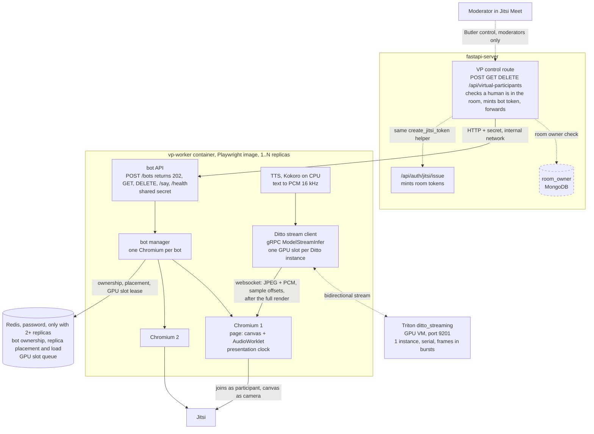

```mermaid
flowchart TB
  M[Moderator in Jitsi Meet]

  subgraph FA["fastapi-server"]
    VPS["VP control route<br/>POST GET DELETE /api/virtual-participants<br/>checks a human is in the room, mints bot token, forwards"]
    AUTH["/api/auth/jitsi/issue<br/>mints room tokens"]
    RO[("room_owner<br/>MongoDB")]
  end

  subgraph W["vp-worker container, Playwright image, 1..N replicas"]
    API["bot API<br/>POST /bots returns 202, GET, DELETE, /say, /health<br/>shared secret"]
    MGR["bot manager<br/>one Chromium per bot"]
    C1["Chromium 1<br/>page: canvas + AudioWorklet<br/>presentation clock"]
    C2["Chromium 2"]
    TTS["TTS, Kokoro on CPU<br/>text to PCM 16 kHz"]
    DTS["Ditto stream client<br/>gRPC ModelStreamInfer<br/>one GPU slot per Ditto instance"]
  end

  KV[("Redis, password, only with 2+ replicas<br/>bot ownership, replica placement and load<br/>GPU slot queue")]
  T["Triton ditto_streaming<br/>GPU VM, port 9201<br/>1 instance, serial, frames in bursts"]
  J["Jitsi"]

  M -. "Butler control, moderators only" .-> VPS
  VPS -. "room owner check" .-> RO
  VPS -- "HTTP + secret, internal network" --> API
  VPS -. "same create_jitsi_token helper" .-> AUTH
  API --> MGR
  MGR --> C1
  MGR --> C2
  TTS --> DTS
  DTS <-. "bidirectional stream" .-> T
  DTS -- "websocket: JPEG + PCM, sample offsets,<br/>after the full render" --> C1
  MGR -- "ownership, placement, GPU slot lease" --> KV
  C1 -- "joins as participant, canvas as camera" --> J
  C2 --> J

  classDef todo stroke-dasharray: 5 5;
  class RO todo;
```

Dashed: not built yet, or never run against the real model.
